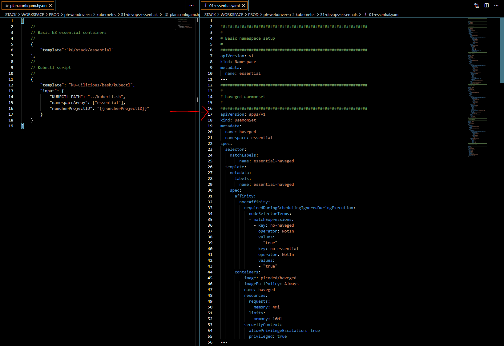

# WIP WARNING (THIS IS INCOMPLETE, AND NOT PROPERLY DOCUMENTED - YOU BEEN WARNED)

---

# Configami

- Configuration
- Origami

A Configuration and templating CLI tool, designed specifically for the use case of config management.
This is designed to be used in conjuncture of other tools such as bash, ansible, and terraform.

Allow the generation of extreamly large YAML files, from a few simple lines and a good template.



The name is a shorten form of "Configuration Origami"

---

# Getting started

To install configami via npm use

```
npm install -g configami
```

---

# Workspace folder structure

A `Configami` workspace would consist of the following sub folders.

- TEMPLATE : Where templates would be searched and used
- WORKSPACE : Where your generated working files would be (eg. terraform/yaml/bash files)

This folder will also be the context where the project is executed from,
as such `package.json` and `node_modules` in here will be used as well.

In addition temporary caching folders may be generated under

- .configami_cache

# Primary use case

Its main goal is to tackle the problem of large 1000+ lines of configuration files,
needing to be managed in a "modern" cloud setup (ie: kubernetes, terraform). With a very small team.

This works by templatising the config file generation process. 

# Example templates

https://github.com/uilicious/configami-k8-template

# Limitations

**This assumes a secure environment**

If you want complex user permission schema to individual config files, it is not a current goal of this project.

**This is not a frontend templating engine**

While it is possible to generate static sites using this CLI, this is not what it was designed for.
That being said, nothing stops you from doing so (lol)
